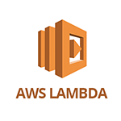

#  Amazon Lambda

- [Description](#description)
- [Installation](#installation)
- [Usage](#usage)
- [Metrics](#metrics)
- [Recommended Statistics](#recommended-statistics)
- [License](#license)

### DESCRIPTION

SignalFx enables you to monitor the health and performance of your Lambda functions via metrics on total invocations, errors, durations and more. In addition, you can easily send custom application or business metrics from within your Lambda functions.

- If you have enabled the SignalFx Amazon Web Services integration and are syncing Cloudwatch metrics, <a target="_blank" href="http://docs.aws.amazon.com/lambda/latest/dg/monitoring-functions-metrics.html">those metrics</a> will automatically be available to view.

-  You can use one of our language-specific wrappers to monitor your functions. Using a wrapper lets you see invocations, errors and durations for your functions in real time, and also provides insight into whether a given function is being impacted by cold starts.

-  The wrapper is also a way for you to send in custom application or business metrics from within a Lambda function, analogous to what you can do with our client libraries for code running in non-Lambda environments.

#### FEATURES

##### Built-in dashboards

- **Lambda (AWS) Overview**: Overview of all data from Lambda via CloudWatch.

  

- **Lambda (SignalFx) Overview**: Overview of all data from Lambda via SignalFx Wrapper.

  

- **Lambda (AWS) Function**: Instance view for specific Lambda function via CloudWatch.

  

- **Lambda (SignalFx) Function**: Instance view for specific Lambda function via SignalFx Wrapper.

  

### INSTALLATION

#### SignalFx Wrapper

SignalFx Wrapper provides real time monitoring of lambda functions as well as ability to send custom metric from your applications to SignalFx.

To use SignalFx Wrapper, include SignalFx Lambda Wrapper in your Lambda function.

Instructions are provided in each of the Lambda wrapper readme files.

- <a target="_blank" href="https://github.com/signalfx/lambda-java">Java</a>
- <a target="_blank" href="https://github.com/signalfx/lambda-nodejs">NodeJs</a>
- <a target="_blank" href="https://github.com/signalfx/lambda-python">Python</a>
- <a target="_blank" href="https://github.com/signalfx/lambda-csharp">C#</a>
- <a target="_blank" href="https://github.com/signalfx/lambda-go">Go</a>

#### CloudWatch

To access this integration, [connect to CloudWatch](https://github.com/signalfx/integrations/tree/master/aws).

By default, SignalFx will import all CloudWatch metrics that are available in your account. To retrieve metrics for a subset of available services or regions, modify the connection on the Integrations page.

### USAGE

#### Uniquely identifying Lambda

##### SignalFx Wrapper

SignalFx uses a unique ARN (Amazon Resource Names) of the function instance in the dimension `lambda_arn`.

##### CloudWatch

SignalFx synthesizes a unique ID for each Lambda function instance in the dimension `AWSUniqueId`.

### METRICS

#### SignalFx Wrapper

The SignalFx Lambda wrapper sends the following metrics to SignalFx:

| Metric Name  | Type | Description |
| ------------- | ------------- | ---|
| function.invocations  | Counter  | Count of Lambda invocations|
| function.cold_starts  | Counter  | Count of cold starts|
| function.errors  | Counter  | Count of errors from underlying Lambda handler|
| function.duration  | Gauge  | Milliseconds in execution time of underlying Lambda handler|

The Lambda wrappers add several dimensions to data points sent to SignalFx. These dimensions can be used for filtering and aggregation.

| Dimension | Description |
| ------------- | ---|
| lambda_arn  | Amazon Resource Name (ARN) of the Lambda function instance |
| aws_region  | AWS region where the Lambda function is executed  |
| aws_account_id | AWS Account ID associated with the Lambda function  |
| aws_function_name  | Name of the Lambda function |
| aws_function_version  | Version of the Lambda function |
| aws_function_qualifier  | AWS function version qualifier (version or version alias if it is not an event source mapping Lambda invocation) |
| event_source_mappings  | AWS function name (if it is an event source mapping Lambda invocation) |
| aws_execution_env  | AWS execution environment (e.g. AWS_Lambda_nodejs6.10) |
| function_wrapper_version  | SignalFx function wrapper qualifier (e.g. signalfx-lambda-0.0.9) |
| metric_source | The literal value of 'lambda_wrapper' |

#### CloudWatch

For more information about the metrics emitted by Lambda, see the documentation at <a target="_blank" href="https://docs.signalfx.com/en/latest/integrations/aws-info.html#lambda-metadata">https://docs.signalfx.com/en/latest/integrations/aws-info.html#lambda-metadata</a>.

<!--- METRICS --->
### RECOMMENDED STATISTICS

No CloudWatch recommended statistics for this integration.

### LICENSE

This integration is released under the Apache 2.0 license. See [LICENSE](./LICENSE) for more details.
