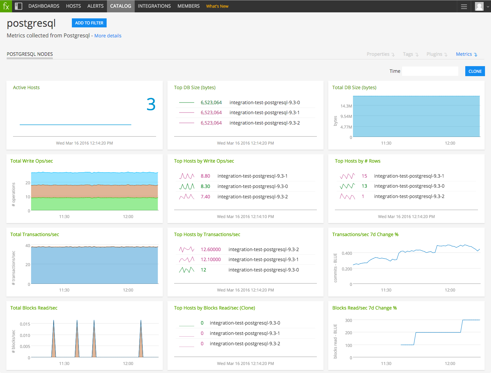

#  PostgreSQL

Metadata associated with the PostgreSQL collectd plugin can be found [here](https://github.com/signalfx/integrations/tree/release/collectd-postgresql). The relevant code for the plugin can be found [here](https://github.com/signalfx/collectd/blob/master/src/postgresql.c).

- [Description](#description)
- [Requirements and Dependencies](#requirements-and-dependencies)
- [Installation](#installation)
- [Configuration](#configuration)
- [Usage](#usage)
- [Metrics](#metrics)
- [License](#license)

### DESCRIPTION

Use the PostgreSQL plugin for collectd to send data about a PostgreSQL database to SignalFx.
From <a target="_blank" href="https://collectd.org/wiki/index.php/Plugin:PostgreSQL">collectd wiki:</a>

>The PostgreSQL plugin connects to and executes SQL statements on a PostgreSQL database. It then reads back the results and, depending on the configuration, the returned values are then converted into collectd “value lists” (the data structure used internally to pass statistics around).

Documentation for PostgreSQL can be found at <a target="_blank" href="http://www.postgresql.org/docs/manuals/">http://www.postgresql.org/docs/manuals/</a>.

#### FEATURES

##### Built-in dashboards

- **PostgreSQL Nodes**: Overview of data from all PostgreSQL nodes.

  

- **PostgreSQL Node**: Focus on a single PostgreSQL node.

    

### REQUIREMENTS AND DEPENDENCIES

This plugin requires:

| Software          | Version        |
|-------------------|----------------|
| collectd |  4.5+  |

### INSTALLATION

1. Installing the plugin:
    * On RHEL/CentOS and Amazon Linux systems, run the following command to install this plugin:

            yum install collectd-postgresql

    * On Ubuntu and Debian systems, this plugin is included by default with the [SignalFx collectd agent](https://github.com/signalfx/integrations/tree/master/collectd).

2. Download SignalFx's <a target="_blank" href="https://github.com/signalfx/integrations/blob/master/collectd-postgresql/10-postgresql.conf">sample PostgreSQL configuration file</a> to `/etc/collectd/managed_config`.

   **_Note:_** _For versions of PostgreSQL older than 0.92, use_ <a target="_blank" href="https://github.com/signalfx/integrations/blob/master/collectd-postgresql/10-postgresql_pre92.conf">this configuration file</a> instead.

3. Modify the sample configuration file to provide values that make sense for your environment, as described in [Configuration](#configuration) below.

4. Restart collectd.

### CONFIGURATION

Using the example configuration file <a target="_blank" href="https://github.com/signalfx/integrations/blob/master/collectd-postgresql/10-postgresql.conf">10-postgresql.conf</a> or <a target="_blank" href="https://github.com/signalfx/integrations/blob/master/collectd-postgresql/10-postgresql_pre92.conf">10-postgresql\_pre92.conf</a> as a guide, provide values for the configuration options listed below that make sense for your environment and allow you to connect to the PostgreSQL database to be monitored.

| configuration option | definition | example value |
| ---------------------|------------|---------------|
| Host | Hostname at which collectd can connect to PostgreSQL | localhost |
| User  | Username that collectd will use to access PostgreSQL | collectd\_user |
| Password  | Password for the user specified in User | Password123 |

No additional configuration is necessary if you are using SignalFx's example configuration file. However, you may wish to change the name of the database from the default of "postgres" within the starting tag of the `<Database>` block. This name is what will be reported on the plugin\_instance dimension for metrics coming from this database. For complete documentation of configuration options, see <a target="_blank" href="https://collectd.org/documentation/manpages/collectd.conf.5.shtml#plugin_postgresql">collectd's manpage for this plugin</a>.

#### System modifications

PostgreSQL plugin uses PostgreSQL's statistics collector which should be enabled by default. The flags are `track_activities` and `track_counts`.

### USAGE

Sample of built-in dashboard in SignalFx:

### METRICS

For documentation of the metrics and dimensions emitted by this plugin, [click here](./docs).

### LICENSE

This integration is released under the Apache 2.0 license. See [LICENSE](./LICENSE) for more details.
