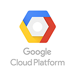

#  Google Cloud Platform

- [Description](#description)
- [Configuration](#configuration)
- [Usage](#usage)
- [Metrics](#metrics)
- [License](#license)

### DESCRIPTION

Use SignalFx to monitor Google Cloud Platform (GCP) services via StackDriver Monitoring. This integration enables data collection from all GCP web services that report to StackDriver.

#### FEATURES

Connecting to GCP allows you to take advantage of SignalFx’s extensive GCP support.

- SignalFx can sync metadata about your GCP hosts to enrich metrics reported by StackDriver or the [SignalFx collectd agent](https://github.com/signalfx/integrations/tree/master/collectd).
- SignalFx provides built-in dashboards for many GCP services that report to StackDriver, such as [Google Compute Engine](https://github.com/signalfx/integrations/tree/master/google-compute-engine) and [Google Cloud Datastore](https://github.com/signalfx/integrations/tree/master/google-cloud-datastore).

### CONFIGURATION

To connect SignalFx to Google Cloud Platform (GCP), you’ll create a new GCP project service account key for SignalFx to use and specify services to monitor in SignalFx. You must be an administrator of your SignalFx account to connect SignalFx to GCP. [Click here for detailed instructions](http://docs.signalfx.com/en/latest/getting-started/send-data.html#connect-to-google-cloud-platform).

### USAGE

See [our detailed GCP integration guide](https://docs.signalfx.com/en/latest/integrations/gcp-info.html) for more information.

### METRICS

For more information about the metrics emitted by GCP StackDriver, see the documentation for individual services.

### LICENSE

This integration is released under the Apache 2.0 license. See [LICENSE](./LICENSE) for more details.
